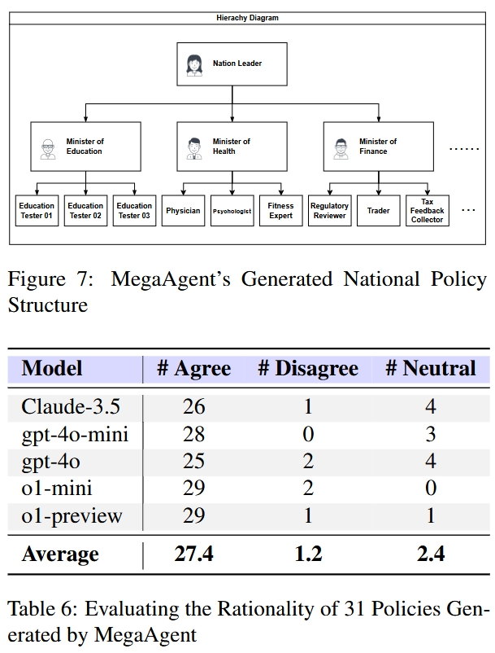

# MegaAgent: A Large-Scale Autonomous LLM-based Multi-Agent System Without Predefined SOPs

MegaAgent is a framework designed to manage autonomous cooperation in  large-scale LLM-powered multi-agent systems, enabling dynamic agent  generation, task auto-splitting, and enhanced communication without  relying on predefined operating procedures.


## Framework


## Code Overview

This repository contains two parts: the latest version of MegaAgent at `.`, and examples at `examples/`.

To run the latest version, you can add your key and change the prompt in `config.py`, and run `main.py`. The output will be located at `files/`. The default prompt is used for automatically generating a Gobang game.

Some experiments are shown in `examples/` using an older version of MegaAgent. You can use the same prompt while substituting other files with the latest version.

## Experimental Results




| Model         | MBPP  | HumanEval | MATH  | GSM-8k |
| ------------- | ----- | --------- | ----- | ------ |
| MetaGPT       | 81.7% | 82.3%     | N/A   | N/A    |
| Camel         | 78.1% | 57.9%     | 22.3% | 45.6%  |
| AgentVerse    | 82.4% | 89.0%     | 54.5% | 81.2%  |
| AutoGen       | 85.3% | 85.9%     | 69.5% | 87.8%  |
| **MegaAgent** | 92.2% | 93.3%     | 69.0% | 93.0%  |

(Quantitative experiments using gpt-4o as backbone)

We also used GPT-4o to achieve the following results on TravelPlanner. The submission file is included in `examples/travel planner`.

- Delivery Rate: 100.0%
- Commonsense Constraint Micro Pass Rate: 81.88%
- Commonsense Constraint Macro Pass Rate: 27.22%
- Hard Constraint Micro Pass Rate: 40.48%
- Hard Constraint Macro Pass Rate: 23.89%
- Final Pass Rate: 10.0%


## Licenses

This repository is under license CC BY 4.0.

## Citation
If you find this repository useful, please cite our paper:

```
@article{wang2024megaagent,
  title={Megaagent: A practical framework for autonomous cooperation in large-scale llm agent systems},
  author={Wang, Qian and Wang, Tianyu and Li, Qinbin and Liang, Jingsheng and He, Bingsheng},
  journal={arXiv e-prints},
  pages={arXiv--2408},
  year={2024}
}
```
